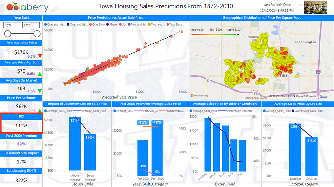

# 🏠 Iowa Housing Sales Dashboard

🔗 **Live Dashboard**  
👉 [Click here to view on Power BI](https://app.powerbi.com/view?r=eyJrIjoiMmEwM2VkOTQtODY3My00NmQxLTgzMGEtMTVjNTM5YmY0ZjlkIiwidCI6ImYxYWQ2ODFmLTZmNjItNDNhOS04MjQxLTA3MDMxNjBlMTM0OCIsImMiOjN9)

---

## Executive Summary

This dashboard visualizes key metrics related to housing sales, price trends, and the impact of various property features. It provides actionable insights to help stakeholders understand historical data, optimize pricing strategies, and identify key drivers of market performance.

---

## Background

Housing sales are influenced by numerous factors, including location, property size, and market conditions. By analyzing over a century's worth of data, this dashboard enables a deeper understanding of market trends, helping real estate professionals and policymakers make informed decisions.

---

## Problem Statement

How can we accurately predict the sale prices of homes using various property features, while understanding the key drivers that influence housing market trends? This includes addressing challenges such as handling diverse data types, capturing complex relationships, and ensuring actionable insights for real estate stakeholders like agents, buyers, and investors.

---

## Objectives

Visualize housing sales trends across Iowa over time.
Identify key property features influencing sale prices.
Optimize decision-making through predictive sales models.

---

## Data Overview

Data Source:
Historical housing sales data from 1872 to 2010. (Kaggle)
Key Metrics:
Average Sales Price
Price per Bedroom
ROI and Post-2000 Premium
Basement Size Impact
Lot Size and Exterior Condition Analysis

---

## System Architecture

The dashboard integrates historical sales data, preprocessing pipelines, and advanced visualization techniques, ensuring a seamless and user-friendly interface for exploring insights.

---

## Data Features

The dataset is structured into three main tables:

df1 Table: Contains core property details, such as basement category, lot area, bedrooms, building type, exterior condition, fireplaces, and geographical coordinates (latitude and longitude). It also includes temporal fields like listing date and decade.

DateTable: Focused on temporal data, including date, day, month name, month number, and quarter, enabling time-based analysis.

Prediction_Table: Features predictive metrics, such as sale price, predicted sales, absolute error, percentage error, and MAE (Mean Absolute Error). It also includes key property attributes like lot frontage, overall condition, and year built for prediction model evaluation.

This structure integrates historical, property-specific, and predictive data to support robust analysis and accurate forecasting.

---

## Data Preparation

The data preparation process involved the following key steps:

Data Cleaning: Addressed missing values, removed duplicates, and handled outliers to ensure data accuracy and consistency.
Feature Engineering: Created derived features like LotSizeCategory and Percentage Error to enhance model performance.
Data Transformation: Standardized numerical features (e.g., Lot_Area, Sale_Price) and encoded categorical variables (e.g., Bldg_Type, House_Style) for seamless integration into predictive models.
Table Relationships: Established logical relationships between tables (e.g., df1, DateTable, Prediction_Table) to facilitate efficient querying and data exploration.

These steps ensured a clean, structured, and well-integrated dataset ready for analysis and predictive modeling.

---

## Model Selection

This dashboard leverages machine learning models developed using Microsoft Fabric to predict housing sale prices. A regression-based approach was employed, enabling the analysis of relationships between key property features (e.g., lot size, year built, and exterior condition) and sale prices. By integrating Microsoft Fabric's powerful data processing and modeling capabilities, the regression models provide accurate and actionable predictions, enhancing insights for real estate stakeholders.

---

## Model Development

The dashboard leverages the XGBoost Regressor, identified as the best-performing model through extensive evaluation of 46 different models. This regression model was trained on 2,413 selected data points, with 1,930 points used for training and 483 for cross-validation. Key metrics demonstrate the model's performance:

R² (Coefficient of Determination): 1.0, indicating perfect predictive accuracy.
Mean Squared Error (MSE): 23,040,876.2
Mean Absolute Error (MAE): 11,031.6
Median Absolute Error: 797.7
Variance: 1.0

This robust model development process highlights the efficacy of the chosen regression model in accurately predicting housing sale prices, providing reliable insights for stakeholders.

---

## Model Performance

The XGBoost Regressor achieved exceptional performance during cross-validation:

R²: 1.0 (perfect prediction accuracy).
Mean Squared Error (MSE): 23,040,876.2 (measuring prediction error magnitude).
Mean Absolute Error (MAE): 11,031.6 (average absolute prediction error).
Median Absolute Error: 7,977.7 (midpoint absolute error).
Variance: 1.0 (perfect fit consistency).

These metrics indicate the model's effectiveness in accurately predicting housing sale prices.

---

## Visualizations

The dashboard provides key insights into housing sales trends and predictions, showcasing the relationship between predicted and actual sales through a scatter plot, which highlights the model's accuracy across various home types. A geographical heatmap visualizes price per square foot, identifying high-value areas. Key metrics include an average sales price of $176K (-6.5%), an average price per square foot of $169K (+0.6%), and a price per bedroom of $62K (+2.5%). The analysis highlights the impact of specific features, such as above-average basement sizes, which add a $69K premium, and larger lot sizes, which average $208K compared to $153K for smaller lots. Additionally, properties with excellent exterior conditions yield the highest prices, while poor conditions show a declining trend. Homes built post-2000 command a 49% higher premium, emphasizing the importance of modernization. These visualizations enable stakeholders to evaluate market trends, predict housing prices, and identify the most influential property features. 

---

## Case 1 Objective

Optimize property conditions by renovating homes to meet modern standards.

Positive Insight: Homes built post-2000 sell for 49% more than the average price.

---

## Negative Insights

Properties with below-average basement sizes sell for 31.92% less than the average price.

---

## ROI

Hypothetical renovation cost of $15,000 yields an ROI of 111%, based on the added value per property.

---

## Case 2 Objective

Positive Insight: Homes with lot areas >10,000 sqft sell for 36% more than the average price.

---

## Negative Insights

Poor external conditions lead to a 40% decrease in sale price.

---

## Landscaping ROI

Landscaping and marketing investments of $10,000 yield an ROI of 327%, leveraging high-lot properties' value.

---

## Summary

The analysis highlights actionable strategies to optimize property value through targeted renovations and enhancements. In Case 1, renovating homes to meet modern standards can significantly increase value, with post-2000 homes selling for 49% more than the average price. Conversely, properties with below-average basement sizes sell for 31.92% less. A renovation investment of $15,000 yields an impressive ROI of 111%. In Case 2, enhancing lot value and external conditions proves beneficial, as homes with lot areas exceeding 10,000 sqft sell for 36% more than the average price, while poor external conditions lead to a 40% drop in value. Landscaping and marketing investments of $10,000 deliver a remarkable ROI of 327%, leveraging the potential of high-lot properties. These insights provide a clear roadmap for maximizing property value through strategic improvements.

---

## Solution Impact

The solution demonstrates a significant impact by leveraging data-driven insights to optimize property value. Renovations and enhancements targeting modern standards, lot size, and external conditions result in increased property appeal and marketability. Strategic investments, such as a $15,000 renovation yielding a 111% ROI and $10,000 landscaping generating a 327% ROI, highlight the effectiveness of targeted improvements. These actions empower real estate stakeholders to make informed decisions, enhance property performance, and maximize returns on investment.

---

## Business Outcomes

The implementation of this solution delivers significant business outcomes by combining predictive analytics, actionable insights, and data-driven decision-making. Key outcomes include:

Increased Property Value: Targeted renovations and landscaping improvements lead to substantial ROI, such as 111% from modernization investments and 327% from landscaping, enhancing profitability for real estate stakeholders.

Optimized Pricing Strategies: Accurate price predictions enable real estate agents and investors to set competitive yet profitable pricing, minimizing undervaluation or overpricing risks.

Improved Decision-Making: Insights into the impact of features like lot size, basement size, and exterior conditions empower stakeholders to make informed investment and development decisions.

Enhanced Market Position: By leveraging data-driven strategies, real estate professionals can attract buyers, improve client satisfaction, and strengthen their market presence.

Scalability: The use of advanced machine learning models and Microsoft Fabric ensures a scalable solution that can adapt to future market trends and integrate additional data sources.

This solution not only maximizes financial returns but also establishes a robust framework for long-term growth and innovation in the real estate sector.

---

## Key Achievments

---

## Challenges and Solutions

Challenge: Managing data quality issues, such as missing values and outliers.

Solution: Implemented rigorous data cleaning processes and standardized preprocessing techniques.

Challenge: Balancing model complexity to avoid overfitting while maintaining accuracy.

Solution: Utilized cross-validation and hyperparameter tuning for optimal model performance.

Challenge: Interpreting complex relationships between diverse property features.

Solution: Leveraged feature engineering and advanced visualization techniques to clarify key drivers.

Challenge: Ensuring the scalability of the predictive system for future trends.

Solution: Designed a flexible architecture using Microsoft Fabric to integrate additional data sources and support long-term adaptability.

---

## Lessons Learned

Data Integrity is Critical: Clean, well-prepared data is foundational for building reliable predictive models and generating actionable insights.

Iterative Model Development: Testing and refining models through techniques like cross-validation and hyperparameter tuning ensures robust and accurate predictions.

Visualization Enhances Understanding: Clear and interactive visualizations simplify complex relationships, enabling better communication of insights to stakeholders.

Scalability Drives Long-Term Success: A flexible architecture allows for the integration of new data and adaptation to evolving trends, ensuring the solution remains relevant over time.

---

## Future Capabilities

Integration of Economic Trends: Incorporate external data, such as interest rates, inflation, and job growth, to enhance market forecasting and property value predictions.

Real-Time Data Updates: Enable live data feeds for dynamic updates to predictions and insights, ensuring stakeholders have access to the latest market conditions.

Enhanced Personalization: Develop algorithms that provide tailored recommendations for property improvements based on specific features and market demands.

Geospatial Analysis Expansion: Improve geographical insights by integrating advanced mapping tools and regional trend analyses to identify high-value areas and growth opportunities.

---

## References

Microsoft Fabric Documentation (learn.microsoft.com/en-us/fabric/)
Microsoft Power BI Resources (learn.microsoft.com/en-us/power-bi/)
ChatGPT for AI-powered insights (chatgpt.com

